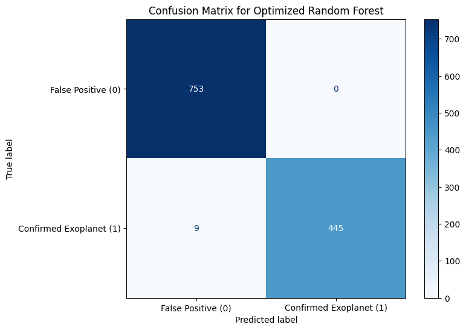
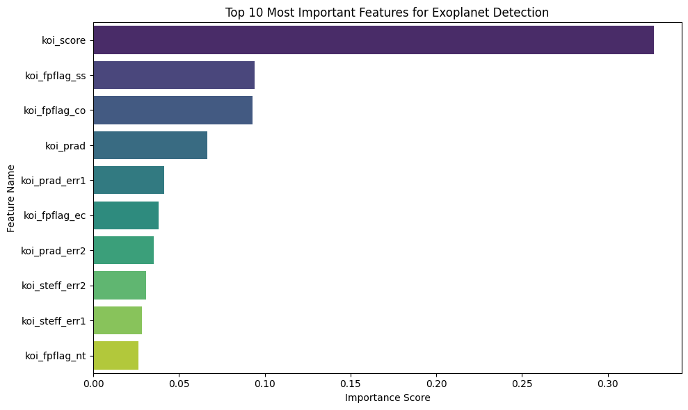

# Exoplanet_Hunting: Automated Astronomer
In this project, I have built a machine learning model that acts as an automated astronomer, looking at the data of NASA's Kepler space telescope to distinguish between a true exoplanet and a false alarm.

## 📌 Project Overview
When an exoplanet crosses in front of its host star, the star's brightness drops slightly. NASA’s Kepler Space Telescope recorded thousands of these light-dimming events, but many of them are false alarms. 

This project builds a Machine Learning pipeline that acts as an "automated astronomer." It analyzes the optical data and physical measurements from the Kepler dataset to classify whether a signal is a **Confirmed Exoplanet** or a **False Positive**.

## 🛠️ Tools used
* **Language:** Python
* **Data Manipulation:** Pandas, NumPy
* **Machine Learning:** Scikit-Learn, XGBoost
* **Handling Imbalanced Data:** SMOTE (imbalanced-learn)
* **Data Visualization:** Matplotlib, Seaborn

## 📊 Dataset
The project uses the `cumulative.csv` dataset from the Kepler space mission. 
* **Challenge:** The dataset is heavily imbalanced (there are far more false alarms than real planets in space). 
* **Solution:** I applied **SMOTE (Synthetic Minority Over-sampling Technique)** to balance the training data, ensuring the model doesn't become biased toward guessing "False Positive."

## 🚀 ML Models Tested
I trained and evaluated three different classification models:
1. Random Forest Classifier
2. XGBoost Classifier
3. Multi-Layer Perceptron (Simple Neural Network)

I then optimized the best-performing model using `RandomizedSearchCV` to find the best hyperparameters.

## 🏆 Final Results

**Optimized Random Forest Performance:**
* *Accuracy:* 0.9925
* *Precision:* 1.0000
* *Recall:* 0.9802
* *F1-Score:* 0.9900

## 🔍 What did the model look at?
By extracting the *Feature Importances* from the Random Forest, the model confirmed that the most critical factors for identifying a planet are related to the transit physicals (such as transit depth and duration), proving the model successfully learned the physics of star-dimming!

## 📷 Data Visualization

**Confusion matrix**

**Top 10 Feature Importances**

